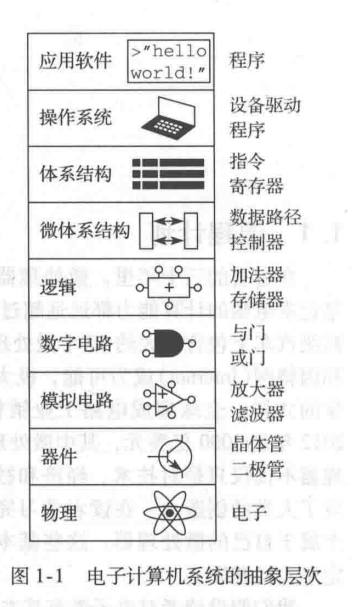
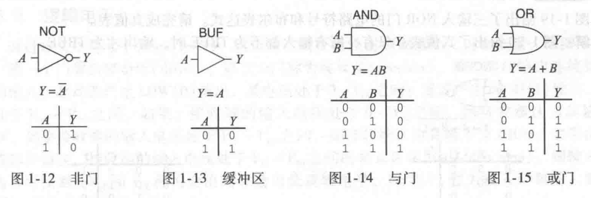
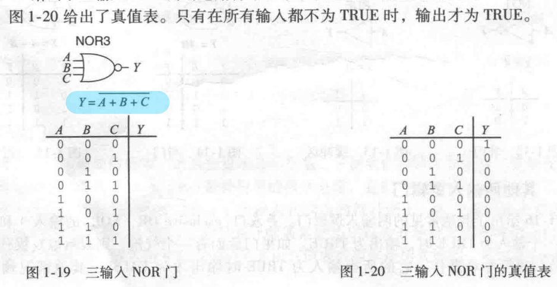
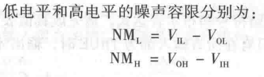
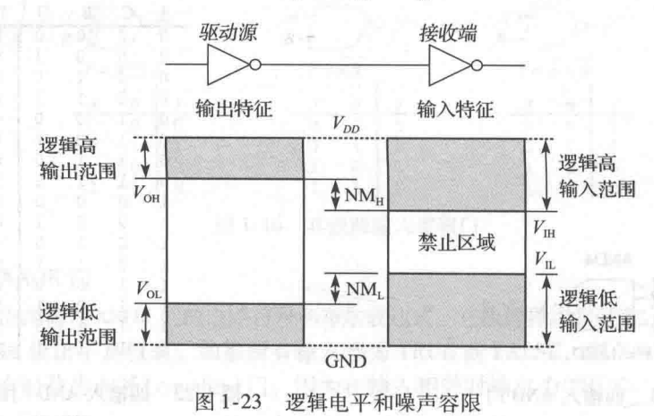

# 第一章 二进制
## 1.2 控制复杂性的艺术
### 1.2.1 抽象
  
本书主要讨论从数字电路到体系结构之间的抽象层次。

### 1.2.2 约束
约束（discipline）是对设计选择的一种内在限制，通过这种限制可以更有效地在更高的抽象层次上工作。  
在本书中，对数字电路的约束非常重要。数字电路使用离散电压，而模拟电路使用连续电
压。因此，数字电路是模拟电路的子集，而且在某种意义上其能力弱于范围更广的模拟电路
然而，数字电路的设计很简单。通过数字电路的约束规则，我们可以很容易地将组件组合成复杂的系统，其再很多应用上都远远优于由模拟组件组成的系统。

### 1.2.3 三Y原则
层次化：将系统划分为模块，直到模块容易理解。  
模块化：所有模块有定义好的功能和借口，以便于它们之间可以很容易地相互连接。  
规整化：在模块之间寻求一致，通用模块可以重复使用多次，以减少设计不同模块的数量。

## 1.3 数字抽象
（1）一个由N个不同状态的离散值变量的信息量D由位（bit，或称比特）度量，D=$\log_{2}N$位。  
（2）‘1’，TRUE，HIGE三者同等含义；‘0’，FALSE，LOW也可以相互替换。
## 1.4 数制
### 1.4.1 十进制
十进制数的基(base)为10

### 1.4.2 二进制
十转二：用2重复除给定的十进制数，余数依次从右写到左

### 1.4.3 十六进制
十六和二互转：从右往左，四位二进制数等同一位十六进制数。  
十转十六：用16重复除给定的十进制数，余数依次从右写到左

### 1.4.4 字节、半字节和全字
（1）微处理器处理的一块数据称为字（word）；  
（2）8位-1字节（byte）；4位-半字节（nibble）；  
（3）权为1的位为最低有效位，另一端则为最高；对于一个字来说，也可用最低有效字节和最高优先字节来表示；  
（4）$2^{10}$ = 1024 $\approx$ $10^{3}$，$2^{10}$ $\approx$ 1千；$2^{20}$ $\approx$ 1兆，$2^{30}$ $\approx$ 1吉；  
（5）1024位称为1千比特（kilobit，KB或Kbit），信息传输速率一般用比特/秒做单位。

### 1.4.5 二进制加法
（1）两数相加大于1，要进位，与十进制加法相同，进位到相邻列的位——进位；
（2）数字系统常常对固定长度的数字进行操作。如果加法结果过大，超出数字表示范围，将产生溢出（overflow），溢出的位被抛弃。   **可以通过检查最高一列是否有进位来判断是否溢出**。

### 1.4.6 有符号的二进制数
有两种表示方法：带符号的原码和补码。  

（1）带符号的原码：最高位为符号位，0表示正数，1表示负数。0则对应两种表示方法，-0和+0，可能会造成影响。  
（2）补码：**二进制补码的最高位为$-2^{N-1}$**，同样正数最高位为0，负数最高位为1。$10···000_{2}$ = $-2^{N-1}$,$11···111_{2}$ = -1。  
（3）求二进制补码：二进制补码的符号位保持不变。首先对数据的每一位取反，然后再数据的最低为加1。应用——计算负数的二进制补码和根据二进制补码表示计算负数。

## 1.5 逻辑门（logic gate）
真值表（truth table）：左边列输入，右边列对应输出。
### 1.5.1 非门（NOT gate）
非门也称反相器（inverter）。输出是输入的反。输入为TRUE，输出则为FALSE。
### 1.5.2 缓冲器（buffer）
将输入复制到输出.三角符号表示一个缓冲器，输出上的圆圈——气泡（bubble），表示取反。
### 1.5.3 与门（AND gate）
输入A和B都为TRUE，输出Y才为TRUE，Y = A · B；Y=AB
### 1.5.4 或门（OR gate）
输入A和B，只要有一个为1，则Y为1，Y = A + B
 
 ### 1.5.5 其他两输入逻辑门
 异或门（XOR）：A和B不同则为1  
 同或门（XNOR）：A和B相同则为1（异或非）（相等门）  
 或非（NOR）：或门再取反，A和B都为0才输出1  
 N输入异或门（**奇偶校验门**）：有奇数个1时输出1
### 1.5.6 多输入门
三输入NOR门

## 1.6 数字抽象
### 1.6.1 电源电压
假设系统中的最低电压为0V，称为地（ground，GND），最高电压来自电源。常称为$V_{DD}$。随着芯片采用了更小的晶体管，$V_{DD}$降低，便于减少功耗和避免晶体管过载。
### 1.6.2 逻辑电平
驱动源的输出连接到接收端的输人。驱动源产生LOW（0）输出，其电压处于0 ~ $V_{OL}$之间：或者产生HIGH（1）输出，其电压处于$V_{OH}$ ~ $V_{DD}$之间。如果，接收端的输人电压处于0～$V_{IL}$之间，则接收端认为其输人为LOW。如果接收端的输人电压处于$V_{IH}$ ~ $V_{DD}$之间，则接收端认为其输人为HIGH。如果由于噪声或部件错误，接收端的输人电压处于$V_{IL}$ ~ $V_{IH}$之间的禁止区域（forbidden zone），则输人门的行为不可预测。$V_{OH}$——输出高逻辑电平，$V_{OL}$——输出低逻辑电平，$V_{IH}$——输入高逻辑电平，$V_{IL}$——输入低逻辑电平。
### 1.6.3 噪声容限
驱动源的输出能够被接收端的输入正确解释，则必须选择$V_{OL}$ < $V_{IL}$ 和$V_{OH}$ > $V_{IH}$。  
可以加在最坏情况输出上但依然能正确解释为有效输入的噪声值——噪声容限（noise margin）

### 1.6.4 直流电压传输特性